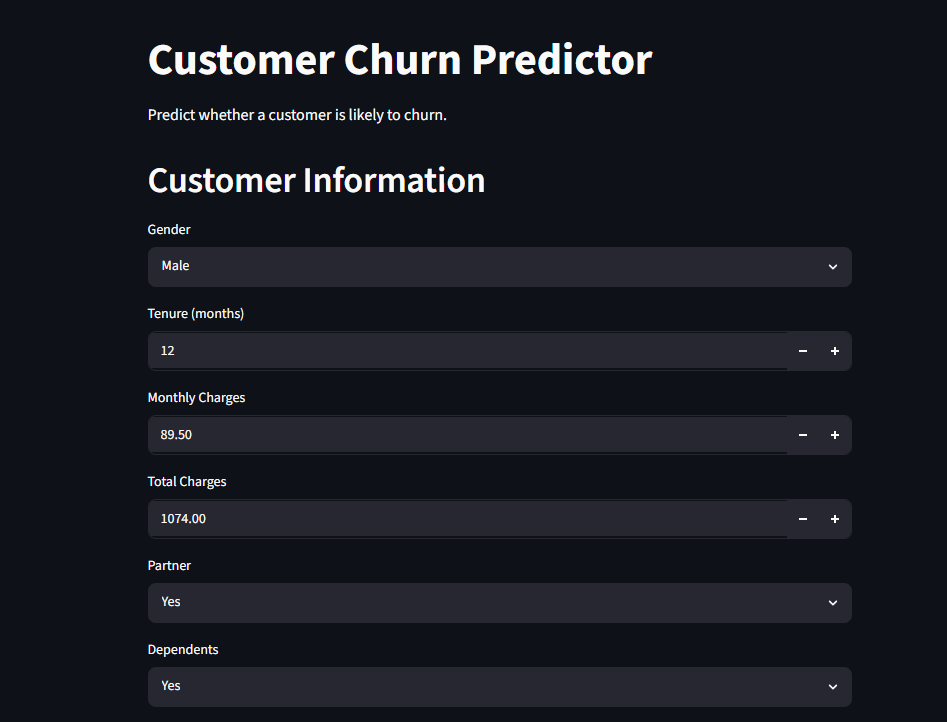
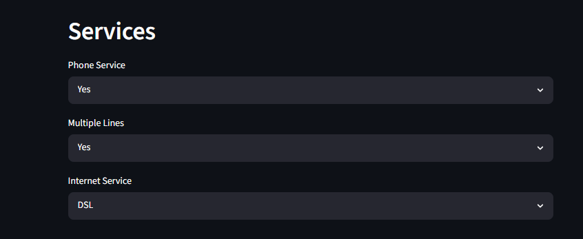
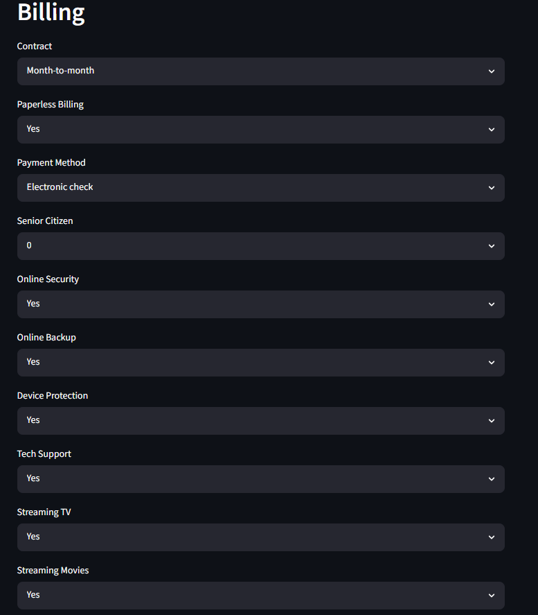
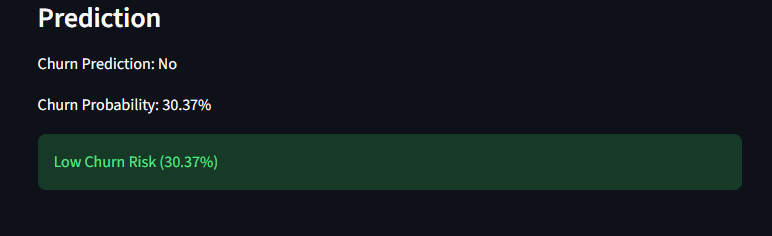

# Customer Churn Prediction System

## Project Overview

Customer churn is one of the most important business metrics for subscription-based companies. Retaining existing customers is often more cost-effective than acquiring new ones.

This project predicts whether a telecom customer is likely to churn based on customer demographics, service subscriptions, contract details, and billing information.

The project includes a complete machine learning pipeline, model evaluation framework, feature analysis, and an interactive Streamlit application for real-time predictions.

---

## Problem Statement

Given customer information, predict whether the customer is likely to leave the telecom service.

Target Variable:

* **Yes** → Customer is likely to churn
* **No** → Customer is likely to remain

---

## Dataset

**Telco Customer Churn Dataset**

The dataset contains customer-level information including:

* Demographic attributes
* Service subscriptions
* Contract information
* Billing and payment details
* Customer tenure
* Churn status

---

## Project Structure

```text
churn_predictor/
│
├── app/
│   └── app.py
│
├── data/
│   └── customer_churn.csv
│
├── models/
│   └── logistic_pipeline.pkl
│
├── notebooks/
│
├── src/
│   ├── preprocess.py
│   ├── train.py
│   ├── evaluate.py
│   ├── predict.py
│   └── feature_importance.py
│
└── README.md
```

---

## Machine Learning Workflow

### Data Preparation

* Cleaned missing values in `TotalCharges`
* Converted data types where necessary
* Separated features and target variable

### Preprocessing Pipeline

* One-Hot Encoding for categorical features
* Standard Scaling for numerical features
* Unified preprocessing using Scikit-Learn `ColumnTransformer`

### Model Development

Models evaluated:

1. Logistic Regression
2. Random Forest

Model selection was performed using 5-Fold Cross Validation.

### Hyperparameter Tuning

GridSearchCV was used to optimize Logistic Regression hyperparameters.

---

## Results

### Model Comparison

| Model               | Cross Validation Score |
| ------------------- | ---------------------- |
| Logistic Regression | 0.7347                 |
| Random Forest       | 0.7064                 |

### Final Model

**Logistic Regression (Best Performing Model)**

| Metric    | Score  |
| --------- | ------ |
| Accuracy  | 0.8053 |
| Precision | 0.6515 |
| Recall    | 0.5749 |
| F1 Score  | 0.6108 |
| ROC-AUC   | 0.8361 |

---

## Key Business Insights

### Factors Associated With Higher Churn

* Fiber Optic Internet Service
* Electronic Check Payment Method
* Streaming TV Subscription
* Streaming Movies Subscription
* Paperless Billing

### Factors Associated With Lower Churn

* Two-Year Contracts
* Longer Customer Tenure
* One-Year Contracts
* Online Security Services
* Technical Support Services

---

## Streamlit Application

The project includes an interactive Streamlit application that allows users to:

* Enter customer information
* Generate churn predictions
* View churn probability in real time

---

## Technologies Used

* Python
* Pandas
* NumPy
* Scikit-Learn
* Streamlit
* Joblib

---

## How to Run

### Install Dependencies

```bash
pip install -r requirements.txt
```

### Train the Model

```bash
python -m src.train
```

### Launch the Streamlit Application

```bash
cd app
streamlit run app.py
```

---

## Author

Hari Sri Sai Bikkina

B.Tech Computer Science Engineering



